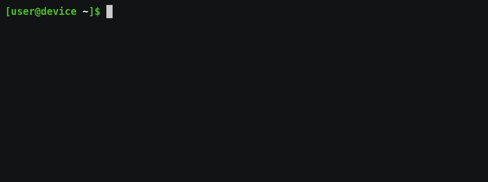

# Git-Inspector


Unit Tests: [](https://circleci.com/gh/yaniksoeltzer/git_inspector)

A python project which inspects git repositories.
```
> git_inspector
```
example output:



## What is reported
The different reports are generated by python modules in `git_inspector/reports`.
So far the following reports are generated:
* `dirty.py` reports repositories with a **dirty working directory**
* `merged_branches.py` reports branches, that are **merged** into the *master* **branch** and can be safely deleted
* `unpushed.py` reports branches, that contain **un-pushed** commits
* `untrached_branches.py` reports branches, that have **no upstream** and exist only locally


## Usage
for help about the usage run `git_inspector --help` 
```
> git_inspector --help
usage: git_inspector [-h] [path [path ...]]

positional arguments:
  path        directory paths in which to look for git modules

optional arguments:
  -h, --help  show this help message and exit
```


## Installation
##### 1. Clone the repository to any location 
```
# https:
git clone https://github.com/yaniksoeltzer/git_inspector.git
# ssh:  
git clone git@github.com:yaniksoeltzer/git_inspector.git
``` 
##### 2. Run the `install.sh` script
```
cd git_inspector
python -m pip install .
```
##### 3. Test if `git_inspector` is installed
```
> git_inspector --help
usage: git_inspector [-h] [path [path ...]]

positional arguments:
  path        directory paths in which to look for git modules

optional arguments:
  -h, --help  show this help message and exit
```
## Uninstall Git-Inspector
To uninstall `git_inspector` run 
```
./un_install.sh
```
